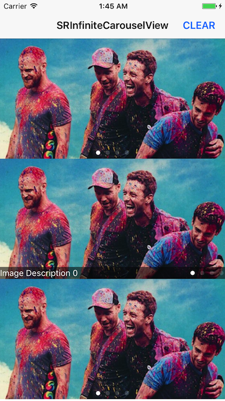

# SRInfiniteCarouselView

Infinite carousel view with local images, urls of images or mixed of them.

## Features

* Only use two UIImageView to achieve infinite carousel.
* UIPageControl will be displayed on the right If there are descriptions, otherwise displayed on the center.
* Not rely on any third-party libraries, use the native API to download and cache image.

## Screenshots




## Installation

### CocoaPods
> Add **pod 'SRInfiniteCarouselView'** to the Podfile, then run **pod install** in the terminal.

### Manual
> Drag the **SRInfiniteCarouselView** folder to the project.

## Usage

````objc
/**
 Creates and returns a SRInfiniteCarouselView object with imageArrary, describeArray, placeholderImage and delegate.
 
 @param imageArrary      The local images or the urls of images or mixed of them.
 @param describeArray    The describes which in the same order as the images.
 @param placeholderImage The placeholder image when internet images have not download.
 @param delegate         The delegate of this object.
 @return A SRInfiniteCarouselView object.
 */
+ (instancetype)sr_carouselViewWithImageArrary:(NSArray *)imageArrary describeArray:(NSArray *)describeArray placeholderImage:(UIImage *)placeholderImage delegate:(id<SRImageCarouselViewDelegate>)delegate;
````

````objc
NSArray *imageArray = @[@"http://i1.piimg.com/4851/859cc36239f5a49e.png",
                        @"http://i1.piimg.com/4851/a47d409e267eb871.png",
                        [UIImage imageNamed:@"coldplay03"],
                        [UIImage imageNamed:@"coldplay04"]];
SRInfiniteCarouselView *imageCarouselView = [SRInfiniteCarouselView sr_carouselViewWithImageArrary:imageArray
                                                                                     describeArray:nil
                                                                                  placeholderImage:nil
                                                                                          delegate:self];
imageCarouselView.frame = CGRectMake(0, 464, self.view.frame.size.width, 200);
imageCarouselView.timeInterval = 10.0;
[self.view addSubview:imageCarouselView];
````

See the demo for more contents.

## Significant Updates

### 2017.01.11
Redesign class structure, add a class to manage network images. It can be applied to other network image download and cache place.   
If you do not like the new way of using, you can also use the previous way, the SRInfiniteCarouselViewDeprecated classes are in 'Deprecated' folder.