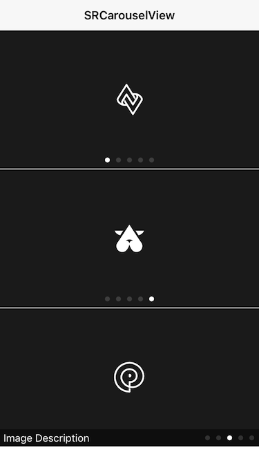

# SRCarouselView

A carousel view that only uses two UIImageView to achieve infinite carousel.



## Features

* [x] Creates with an array that can contain local image, network image or both of them. 
* [x] Not rely on any third-party libraries, use the native api to download and cache image.
* [x] UIPageControl will be displayed on the right If there are descriptions, otherwise displayed on the center. 

## APIs

````objc
+ (instancetype)sr_carouselViewWithImageArrary:(NSArray *)imageArrary;

+ (instancetype)sr_carouselViewWithImageArrary:(NSArray *)imageArrary describeArray:(NSArray *)describeArray;

+ (instancetype)sr_carouselViewWithImageArrary:(NSArray *)imageArrary describeArray:(NSArray *)describeArray placeholderImage:(UIImage *)placeholderImage;

/**
 Creates and returns a infinite carousel view with imageArrary, describeArray, placeholderImage and delegate.
 
 @param imageArrary      An array contains local images, or urls of images, or mixed of them.
 @param describeArray    An array contains image describes which in the same order as the images.
 @param placeholderImage The placeholder image when network image have not downloaded.
 @param delegate         The receiver’s delegate object.
 @return A newly carousel view.
 */
+ (instancetype)sr_carouselViewWithImageArrary:(NSArray *)imageArrary describeArray:(NSArray *)describeArray placeholderImage:(UIImage *)placeholderImage delegate:(id<SRCarouselViewDelegate>)delegate;

/**
 Creates and returns a infinite carousel view with imageArrary, describeArray, placeholderImage and block.

 @param imageArrary      An array contains local images, or urls of images, or mixed of them.
 @param describeArray    An array contains image describes which in the same order as the images.
 @param placeholderImage The placeholder image when network image have not downloaded.
 @param block            A block object to be executed when tap the carousel view.
 @return A newly carousel view.
 */
+ (instancetype)sr_carouselViewWithImageArrary:(NSArray *)imageArrary describeArray:(NSArray *)describeArray placeholderImage:(UIImage *)placeholderImage block:(DidTapCarouselViewAtIndexBlock)block;
````

## Usage

````objc
// local images
NSArray *imageArray = @[[UIImage imageNamed:@"logo01.jpg"],
                        [UIImage imageNamed:@"logo02.jpg"],
                        [UIImage imageNamed:@"logo03.jpg"],
                        [UIImage imageNamed:@"logo04.jpg"],
                        [UIImage imageNamed:@"logo05.jpg"]];
NSMutableArray *describeArray = [[NSMutableArray alloc] init];
for (NSInteger i = 0; i < imageArray.count; i++) {
    NSString *tempDesc = [NSString stringWithFormat:@"Image Description %zd", i + 1];
    [describeArray addObject:tempDesc];
}
SRCarouselView *carouselView = [SRCarouselView sr_carouselViewWithImageArrary:imageArray describeArray:nil placeholderImage:nil delegate:self];
carouselView.frame = CGRectMake(0, 44, self.view.frame.size.width, 200);
carouselView.autoPagingInterval = 10.0;
[self.view addSubview:carouselView];
````

````objc
// network images
NSArray *imageArray = @[@"https://yixunfiles-ali.yixun.arhieason.com/9535a537ad2538d53ec1a351deff3856_jpg.jpg?x-oss-process=image/format,png",
                        @"https://yixunfiles-ali.yixun.arhieason.com/8f8b02a025a7b62e81cafc4e9d89f70e_jpg.jpg?x-oss-process=image/format,png",
                        @"https://yixunfiles-ali.yixun.arhieason.com/6c72618dc3412974369d544a2734d5cb_jpg.jpg?x-oss-process=image/format,png",
                        @"https://yixunfiles-ali.yixun.arhieason.com/63a0bb8cd057e12c45ecbcb7f24e4ecf_jpg.jpg?x-oss-process=image/format,png",
                        @"https://yixunfiles-ali.yixun.arhieason.com/2393d812560715fb9a38df9550b1f749_jpg.jpg?x-oss-process=image/format,png"];
NSMutableArray *describeArray = [[NSMutableArray alloc] init];
for (NSInteger i = 0; i < imageArray.count; i++) {
    NSString *tempDesc = [NSString stringWithFormat:@"Image Description %zd", i];
    [describeArray addObject:tempDesc];
}
SRCarouselView *carouselView = [SRCarouselView sr_carouselViewWithImageArrary:imageArray describeArray:nil placeholderImage:[UIImage imageNamed:@"placeholder_image.jpg"] block:^(NSInteger index) {
    NSLog(@"index: %zd", index);
}];
carouselView.frame = CGRectMake(0, 245, self.view.frame.size.width, 200);
[self.view addSubview:carouselView];
````

````objc
// local and network Images
NSArray *imageArray = @[@"https://yixunfiles-ali.yixun.arhieason.com/9535a537ad2538d53ec1a351deff3856_jpg.jpg?x-oss-process=image/format,png",
                        @"https://yixunfiles-ali.yixun.arhieason.com/8f8b02a025a7b62e81cafc4e9d89f70e_jpg.jpg?x-oss-process=image/format,png",
                        [UIImage imageNamed:@"logo03.jpg"],
                        [UIImage imageNamed:@"logo04.jpg"],
                        [UIImage imageNamed:@"logo05.jpg"]];
NSMutableArray *describeArray = [[NSMutableArray alloc] init];
for (NSInteger i = 0; i < imageArray.count; i++) {
    NSString *tempDesc = [NSString stringWithFormat:@"Image Description"];
    [describeArray addObject:tempDesc];
}
SRCarouselView *carouselView = [SRCarouselView sr_carouselViewWithImageArrary:imageArray describeArray:describeArray placeholderImage:[UIImage imageNamed:@"placeholder"] delegate:self];
carouselView.frame = CGRectMake(0, 446, self.view.frame.size.width, 200);
carouselView.autoPagingInterval = 10.0;
[self.view addSubview:carouselView];
````

## Custom

````objc
/**
 The time interval of auto paging, default is 5.0s.
 */
@property (nonatomic, assign) NSTimeInterval autoPagingInterval;

@property (nonatomic, strong) UIColor *currentPageIndicatorTintColor;
@property (nonatomic, strong) UIColor *pageIndicatorTintColor;

@property (nonatomic, strong) UIImage *currentPageIndicatorImage;
@property (nonatomic, strong) UIImage *pageIndicatorImage;
````