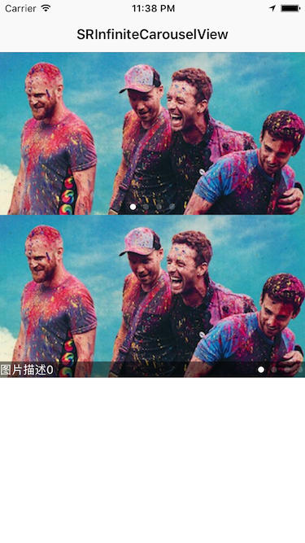

# SRInfiniteCarouselView
**Easy to create infinite carousel view with local image or internet image.**



## Usage

````objc
// Local images
NSArray *imageNames = @[@"coldplay01", @"coldplay02", @"coldplay03", @"coldplay04"];
SRInfiniteCarouselView *infiniteCarouselView = [SRInfiniteCarouselView sr_bannerViewWithFrame:CGRectMake(0, 20, self.view.frame.size.width, 200)
                                                                                   imageNames:imageNames
                                                                                 timeInterval:5.0
                                                                currentPageIndicatorTintColor:nil
                                                                       pageIndicatorTintColor:nil
                                                                                     delegate:self];
[self.view addSubview:infiniteCarouselView];
````

````objc
// Internet images
NSArray *imageURLStrings = @[@"http://i1.piimg.com/4851/859cc36239f5a49e.png",
                             @"http://i1.piimg.com/4851/a47d409e267eb871.png",
                             @"http://i1.piimg.com/4851/a19f19acb7551cce.png",
                             @"http://i1.piimg.com/4851/e92063eb386c232a.png"];
SRInfiniteCarouselView *infiniteCarouselView = [SRInfiniteCarouselView sr_bannerViewWithFrame:CGRectMake(0, 222, self.view.frame.size.width, 200)
                                                                                    imageURLs:imageURLs
                                                                         placeholderImageName:nil
                                                                                 timeInterval:5.0
                                                                currentPageIndicatorTintColor:nil
                                                                       pageIndicatorTintColor:nil
                                                                                     delegate:self];
        
[self.view addSubview:infiniteCarouselView];
````

## Custom Settings
````objc
/**
 Distance to bottom of pageControl, Default is 10.0f.
 */
@property (nonatomic, assign) CGFloat pageControlBottomDistance;

/** 
 Forbid manual scrolling, Default is NO, allow manual scrolling. 
 */
@property (nonatomic, assign) BOOL forbidScrolling;

/** 
 Current page indicator tint color, Default is [UIColor whiteColor]. 
 */
@property (nonatomic, strong) UIColor *currentPageIndicatorTintColor;

/** 
 Other page indicator tint color, Default is [UIColor grayColor]. 
 */
@property (nonatomic, strong) UIColor *pageIndicatorTintColor;
````

**If you have any question, please issue or contact me.**

**If you like it, please star me, thanks a lot.**

**Have Fun.**